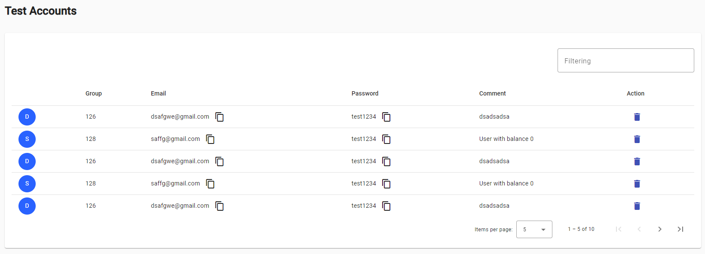
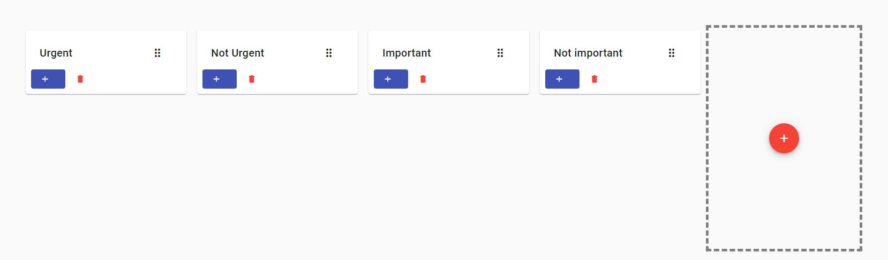
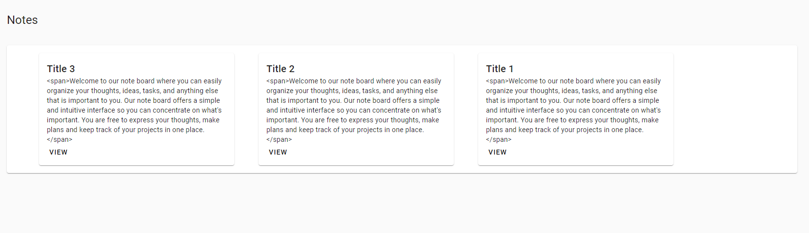
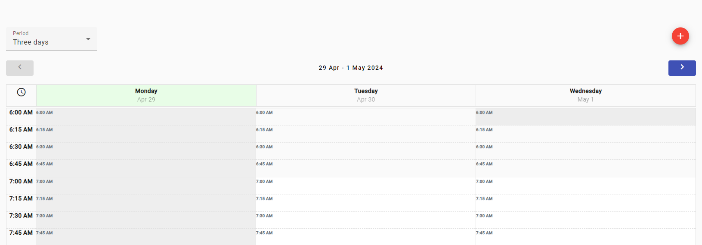

# DevNoteProximity

DevNoteProximity - application with an intuitive interface, providing a wide range of tools for efficient work

### Test Accounts

This page allows users to swiftly create new accounts with ease. Simply fill in the required fields such as email and password, and you're all set to access our platform's features. Our streamlined process ensures a hassle-free registration experience. Once your account is created, easily copy your generated password and email for convenient access.

### Short Notes

Here, you'll find a user-friendly interface with customizable boards where you can effortlessly add new notes or simply drag and drop existing ones. Stay organized and inspired with our intuitive platform.

### Notes

Welcome to our note board where you can easily organize your thoughts, ideas, tasks, and anything else that is important to you. Our note board offers a simple and intuitive interface so you can concentrate on what's important. You are free to express your thoughts, make plans and keep track of your projects in one place.

### Calendar

Our calendar provides you with everything you need to effectively plan and manage your schedule. Whether you need to manage business meetings, events or personal plans, we offer an intuitive and easy-to-use calendar.

# Application: https://nikemaks.github.io/DevNoteProximity/
